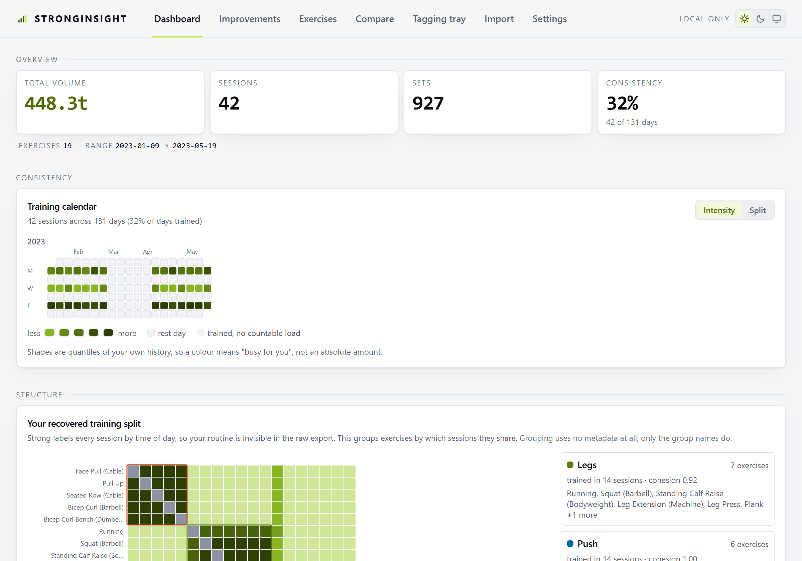
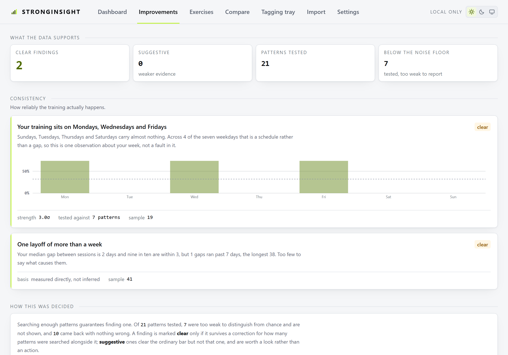
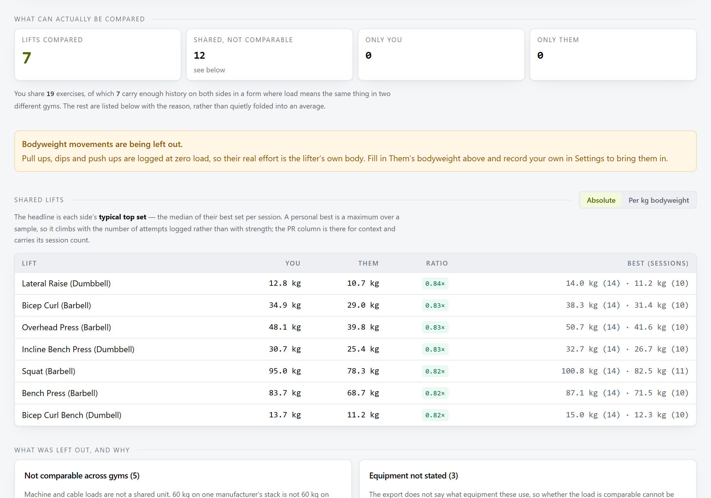
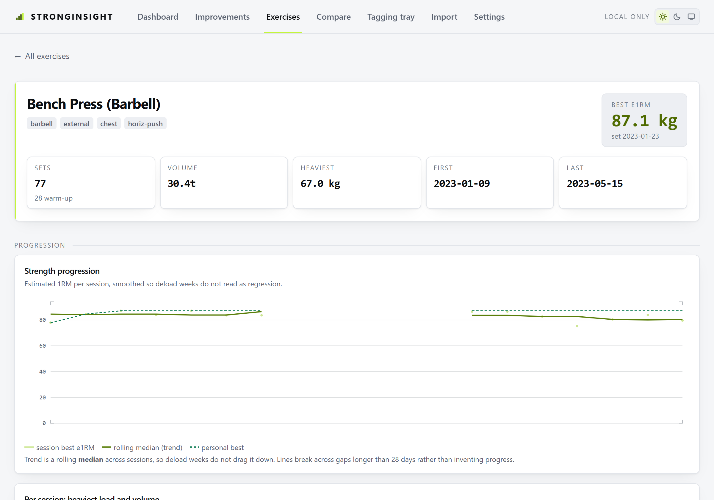
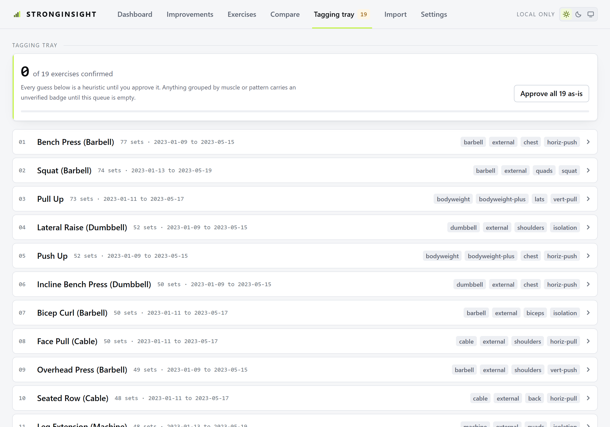

# StrongInsight

[](https://github.com/JonathanContrerasM/StrongInsight/actions/workflows/ci.yml)
[](LICENSE)

Local-first analysis of a [Strong](https://www.strong.app/) workout-tracker CSV export.
Everything runs in the browser; nothing is uploaded and there is no backend.

Drop your export onto the page and it becomes a queryable model of every set you have logged:
progression and volume charts, a training calendar, exercise clustering that recovers your real
training split from Strong's auto-generated workout names, a weakness engine that gates its
findings for statistical significance rather than always finding something, and a comparison
against a second person's export that refuses the comparisons which do not actually mean
anything. Bodyweight work is resolved through a bodyweight history, so a weighted pull up reads
as bodyweight plus the belt rather than as the belt alone.

No backend, no account, no telemetry — there is not a single network call in `src/`.



```bash
npm install
npm run dev      # /  is the landing page, /app.html is the app
npm test
npm run build
```

Then drag `fixtures/sample_workouts.csv` onto the import page — it is a committed, synthetic
export, so a fresh clone has something to look at.

---

## Four things it refuses to get wrong

Each of these is a place where the obvious implementation produces a confident, wrong answer.
Every figure below was measured against a real 6,517-row export, not assumed.

**Bodyweight is real load.** 31% of working sets in the reference export carry weight 0. Treat
weight as absolute and a third of that training computes to zero volume, with the most-trained
movement of all — the pull up — rendered invisible. Load resolves per set against a bodyweight
history. → [The critical design constraint](docs/ingest.md#the-critical-design-constraint-bodyweight)

**Your split is recovered, not guessed.** Strong names every session after the time of day, so the
routine is nowhere in the export — but which exercises share a session is. Clustering on session
co-occurrence recovers Push, Pull and Legs from 199 workouts all labelled `Abend-Workout`, and
below a silhouette of 0.12 it says the split is *not well separated* instead of drawing three
confident boxes around noise. → [The recovered training split](docs/analysis.md#the-recovered-training-split)

**Weaknesses pass a significance gate.** Search seven weekdays for the one you train least and one
of them always comes last. Every finding carries a z and the size of the family it was searched
within; only what survives a Bonferroni correction is reported as *clear*. What got suppressed is
counted and shown, because that number is the feature's credibility.
→ [The Improvements tab](docs/analysis.md#the-improvements-tab-refusing-to-confabulate)

**Bad comparisons are refused, and named.** 60 kg on one manufacturer's stack is not 60 kg on
another's, and a bodyweight movement needs both bodyweights. On the friendliest possible test only
19 of 63 shared exercises were comparable at all — and each refusal is surfaced with its reason
rather than folded into an average.
→ [The Compare tab](docs/analysis.md#the-compare-tab-two-people-and-what-does-not-compare)

---

## What is in it

| | |
|---|---|
| **Dashboard** | Volume, sessions, sets and consistency; a training calendar with three states rather than two; the recovered split; volume over time stacked by muscle or pattern; balance plotted as log2 of the ratio; a muscle heatmap that defaults to row-relative. |
| **Improvements** | Ranked findings across consistency, progression, and neglect and balance — each with its z-score, each gated. Three counters in the open: patterns tested, suppressed as too weak, and tested-and-fine. |
| **Exercises** | Every lift in a sortable table, and behind any row the full history: estimated 1RM, per-session heaviest load and volume as two facets, a load/rep density map, and the set-position profile. |
| **Compare** | A second person's export, compared as rates rather than totals, with an explicit list of what was excluded and why. Never persisted. |
| **Tagging tray** | The queue of exercises whose metadata is still a guess, highest set count first. Anything unconfirmed renders with a visible `unverified` marker wherever it appears. |
| **Import** | An ingest report rather than a spinner: row counts, the W/D split, every unrecognised token with its verbatim value and file line, and the traps found in your own data. |
| **Settings** | Units, week start, bodyweight entries and measurements import, theme, metadata export/import, archive rollback, reset. |

<table>
<tr>
<td width="50%"></td>
<td width="50%"></td>
</tr>
<tr>
<td width="50%"></td>
<td width="50%"></td>
</tr>
</table>

Light and dark are both first-class; every screenshot above has a `-dark` twin in
[`public/shots/`](public/shots).

---

## Privacy

A Strong export is years of training history with exact timestamps — personal health and routine
data. The app is built so that uploading it is not something it *can* do:

- **No account, no backend, no telemetry.** `src/network.test.ts` walks every source file and fails
  on a fetch, a request object, a beacon, a socket or a remote import.
- **Your export stays in your browser.** The raw CSV is kept in IndexedDB on your own device so it
  survives a reload. Clearing site data removes it.
- **A second person's export is never persisted at all** — it lives in a module variable, so a
  reload clears it with no code required.
- **Reset everything means everything.** One button in Settings drops every stored key.

**Never commit a real Strong export.** `fixtures/strong_workouts.csv` and
`fixtures/strong_weight.csv` are gitignored on purpose. The suites measured from them use
`describe.skipIf`, so a clone reports them as *skipped* rather than failing. The screenshots in
this repository are captured from the synthetic fixture only.

---

## Under the hood

React 19, TypeScript (strict), Vite 6, Tailwind v4. **Five runtime dependencies**
(`react`, `react-dom`, `papaparse`, `idb-keyval`, `zod`) and no charting library — all 14 charts are
hand-rolled SVG, because four of the five heatmaps are `<rect>` grids that chart libraries handle
badly and the only part genuinely worth having is a handful of scales.

```
src/
  ingest/   sniffDelimiter, headerMap, classifyRow, parseCsv, parseDuration, report
  model/    types, schemas (Zod), effectiveLoad (+ enrichSets), bodyweight
  meta/     equipment, guessMeta, seedMeta, metaIndex
  store/    idb (withLock), useWorkoutData (the memo graph), useAnalytics
  derive/   e1rm, volume, setCounts, buckets, stats, series, balance, profile,
            cooccurrence, insights, compare   -- PURE, no React, no IO
  ui/       Card, Tile, Button, Field, Badge, theme  -- imports nothing but React
  charts/   scale, colour, ChartFrame + HoverLayer, parts  -- no domain knowledge
  viz/      the charts themselves: derive output -> chart primitives
  views/    Dashboard, Improvements, ExerciseList, ExerciseDetail, Compare,
            TaggingTray, Import, Settings
  landing/  the marketing page at /
```

Two rules carry most of the weight. **Parsing never depends on metadata** — `src/ingest/**` must not
import from `src/meta/**` or `src/store/**`, or every keystroke in the tagging tray would re-parse
6,517 rows. And **`derive/` is pure**: every function is a plain `(sets, metaIndex) => T` with no
React and no IO, which is what makes all of it trivially testable.

**360 tests across 17 files.** The suites measured from the personal export skip automatically when
it is absent, so a fresh clone is green. CI runs `typecheck`, `test` and `build` on every push and
pull request, on a clean checkout — a green badge means a fresh clone is green too.

## Documentation

The reasoning behind every decision that could have gone the other way, kept out of this file so it
stays readable:

- **[The CSV, and its traps](docs/ingest.md)** — the export's real shape, the tagged union in the
  set-order column, the ordering in `classifyRow` that silently swallows 81 isometric holds if
  reversed, the bodyweight load model, and the messiest input the app takes.
- **[Architecture](docs/architecture.md)** — the layering rule, the M1–M5 memo graph and its three
  guards, why the raw CSV is stored rather than the parsed result, the metadata layers, and
  measured performance.
- **[Analysis decisions](docs/analysis.md)** — cosine over Jaccard with the numbers, why monthly
  top-set weight is noise, why per-session peaks are two series, the Bonferroni gate, and the three
  refusals in Compare.
- **[Design system](docs/design-system.md)** — the three token layers and why `@theme inline` is
  load-bearing, dark mode without a `dark:` variant, the chart palette's two locked invariants, the
  empty-app nav rule, the two Vite entries, and the URL hash.

## Contributing

Issues and pull requests are welcome.

```bash
npm install
npm test         # the personal-export suites skip when the CSVs are absent
npm run typecheck
npm run build
```

Two things worth knowing before changing anything, beyond the export rule above:

- **`fixtures/sample_workouts.csv` is generated, not edited.** It comes from
  `scripts/make-sample-fixture.mjs` with a fixed seed and is byte-reproducible. If the sample needs
  to cover a new quirk, add it to the generator, regenerate, and list it in `SAMPLE_QUIRKS` —
  `src/ingest/sample.test.ts` asserts every entry in that list is genuinely present.
- **Colour comes only from the semantic tokens.**
  `grep -rn --text -E "(text|bg|border)-(slate|amber|blue)-[0-9]" src` is expected to return
  nothing, and `src/charts/palette.test.ts` parses `index.css` directly to keep it that way.

## License

[MIT](LICENSE)
